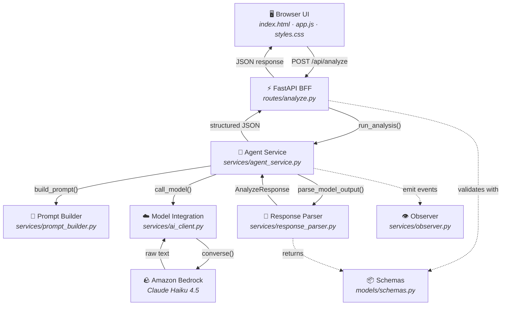
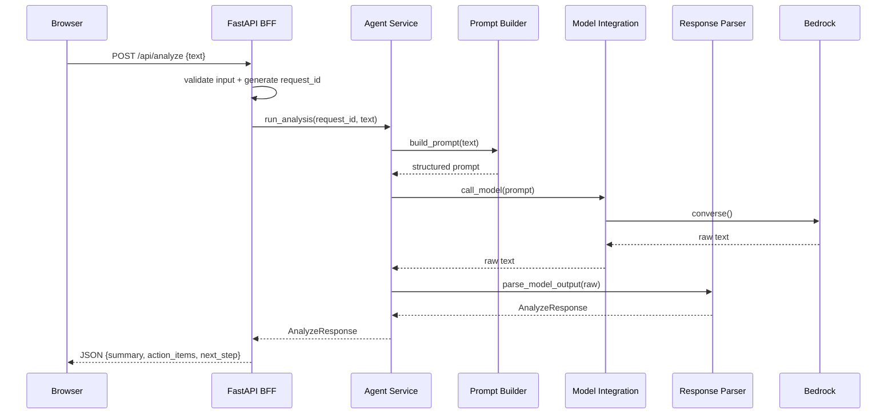
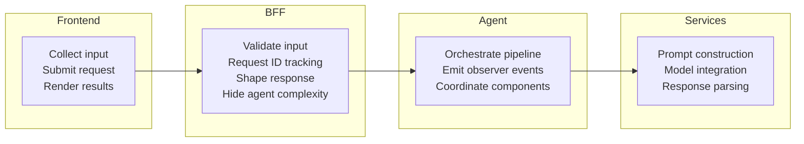

# Architecture

## Component Diagram

```mermaid
graph TD
    UI["🖥️ Browser UI<br/><i>index.html · app.js · styles.css</i>"]
    BFF["⚡ FastAPI BFF<br/><i>routes/analyze.py</i>"]
    AGENT["🧩 Agent Service<br/><i>services/agent_service.py</i>"]
    PROMPT["📝 Prompt Builder<br/><i>services/prompt_builder.py</i>"]
    MODEL["☁️ Model Integration<br/><i>services/ai_client.py</i>"]
    PARSER["🔧 Response Parser<br/><i>services/response_parser.py</i>"]
    OBSERVER["👁️ Observer<br/><i>services/observer.py</i>"]
    BEDROCK["🪨 Amazon Bedrock<br/><i>Claude Haiku 4.5</i>"]
    SCHEMAS["📦 Schemas<br/><i>models/schemas.py</i>"]

    UI -- "POST /api/analyze" --> BFF
    BFF -- "run_analysis()" --> AGENT
    AGENT -- "build_prompt()" --> PROMPT
    AGENT -- "call_model()" --> MODEL
    AGENT -- "parse_model_output()" --> PARSER
    MODEL -- "converse()" --> BEDROCK
    BEDROCK -- "raw text" --> MODEL
    PARSER -- "AnalyzeResponse" --> AGENT
    AGENT -- "structured JSON" --> BFF
    BFF -- "JSON response" --> UI

    AGENT -. "emit events" .-> OBSERVER
    BFF -. "validates with" .-> SCHEMAS
    PARSER -. "returns" .-> SCHEMAS
```

## Request Flow

```mermaid
sequenceDiagram
    participant U as Browser
    participant B as FastAPI BFF
    participant A as Agent Service
    participant P as Prompt Builder
    participant M as Model Integration
    participant R as Response Parser
    participant K as Bedrock

    U->>B: POST /api/analyze {text}
    B->>B: validate input + generate request_id
    B->>A: run_analysis(request_id, text)
    A->>P: build_prompt(text)
    P-->>A: structured prompt
    A->>M: call_model(prompt)
    M->>K: converse()
    K-->>M: raw text
    M-->>A: raw text
    A->>R: parse_model_output(raw)
    R-->>A: AnalyzeResponse
    A-->>B: AnalyzeResponse
    B-->>U: JSON {summary, action_items, next_step}
```

## Layer Responsibilities

```mermaid
graph LR
    subgraph "Frontend"
        A["Collect input<br/>Submit request<br/>Render results"]
    end
    subgraph "BFF"
        B["Validate input<br/>Request ID tracking<br/>Shape response<br/>Hide agent complexity"]
    end
    subgraph "Agent"
        C["Orchestrate pipeline<br/>Emit observer events<br/>Coordinate components"]
    end
    subgraph "Services"
        D["Prompt construction<br/>Model integration<br/>Response parsing"]
    end

    A --> B --> C --> D
```
